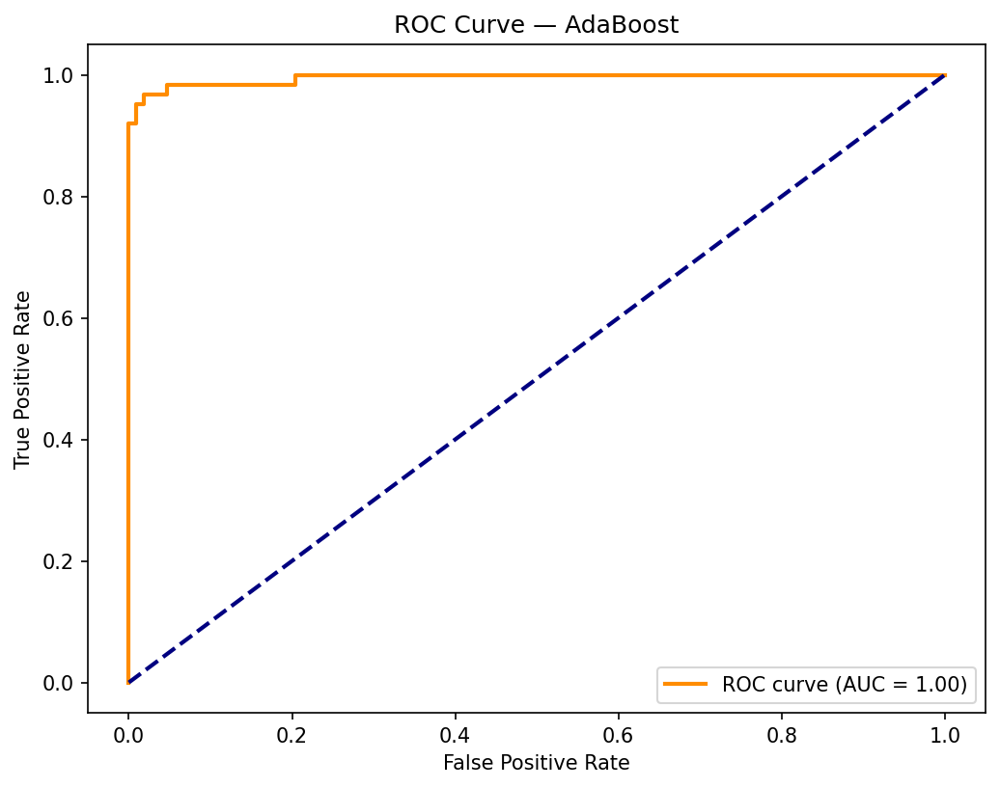
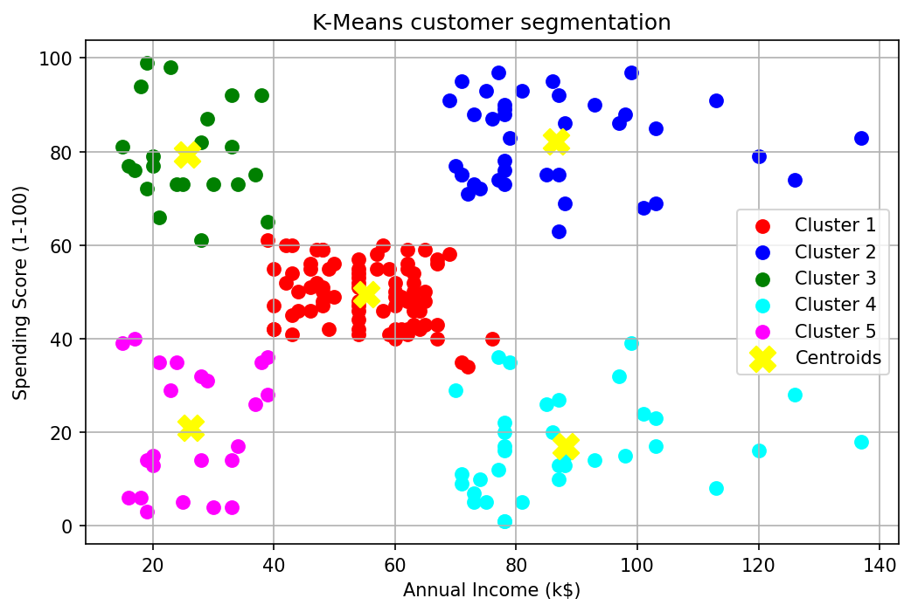
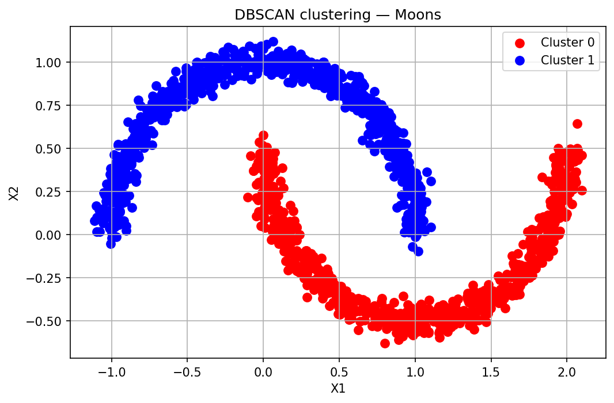
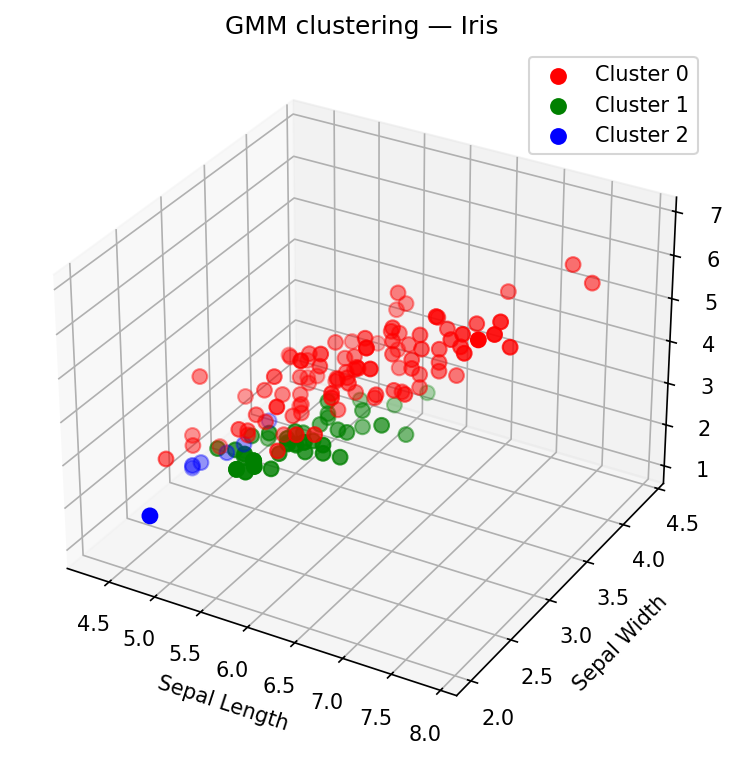
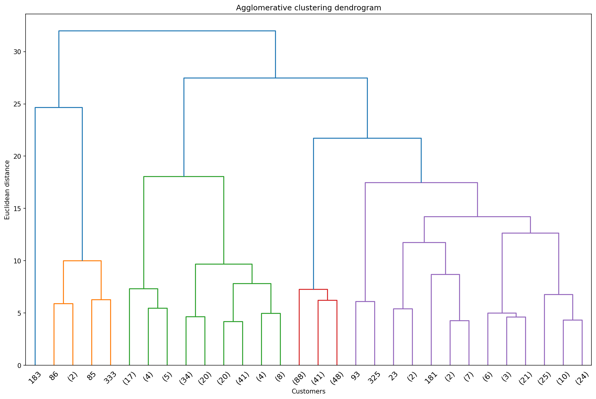
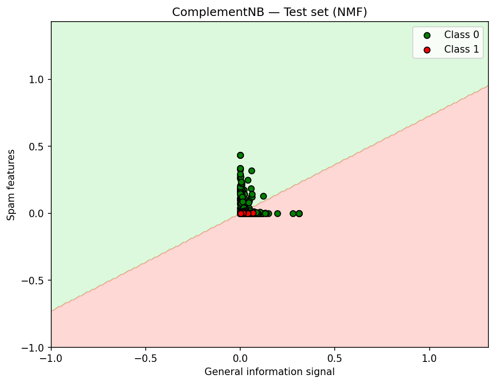

# Machine Learning Lab

[](https://python.org)
[](LICENSE)
[](https://github.com/YOUR_USERNAME/MachineLearningLab/actions/workflows/ci.yml)

> Educational Python project exploring supervised and unsupervised machine learning algorithms across three lab exercises. Each lab contains a standalone script and a matching Jupyter notebook.

---

## Results Summary

### Lab 2 — Supervised Classification

| Algorithm | Dataset | Samples | Accuracy |
|-----------|---------|---------|----------|
| AdaBoost (50 stumps) | Breast Cancer | 569 | **97.08 %** |
| CN2 Rule Learner | Mushrooms | 8 124 | **99.75 %** |
| CART Decision Tree | Titanic (synthetic) | 418 | ~85 % |
| Complement Naive Bayes | SMS Spam | 5 572 | **93.18 %** |
| RBF + Logistic Regression | Credit Card Fraud | 284 807 | ~59 % (imbalanced) |
| RBF + Logistic Regression | Heart Disease | 303 | ~82 % |

### Lab 3 — Unsupervised Clustering

| Algorithm | Dataset | Clusters | Silhouette |
|-----------|---------|----------|------------|
| K-Means | Mall Customers | 5 | ~0.55 |
| DBSCAN | Moon-shaped data | 2 | ~0.90 |
| Gaussian Mixture Model | Iris | 3 | ~0.57 |
| Agglomerative (Ward) | Wholesale Customers | 4 | ~0.45 |

---

## Example Plots

<details>
<summary>Click to expand</summary>

> Run any script to generate plots. They are saved automatically to `results/`.

| AdaBoost — ROC Curve | K-Means — Customer Segmentation |
|:---:|:---:|
|  |  |

| DBSCAN — Moon Clusters | GMM — Iris 3D |
|:---:|:---:|
|  |  |

| Agglomerative — Dendrogram | ComplementNB — Decision Boundary |
|:---:|:---:|
|  |  |

</details>

---

## Tech Stack

| Library | Version | Purpose |
|---------|---------|---------|
| Python | 3.10+ | Runtime |
| pandas | ≥ 2.0 | Data manipulation |
| numpy | ≥ 1.24 | Numerical computation |
| matplotlib / seaborn | ≥ 3.7 / ≥ 0.12 | Visualisation |
| scikit-learn | ≥ 1.3 | ML algorithms |
| Orange3 | ≥ 3.35 | CN2 rule-based classifier |
| scipy | ≥ 1.11 | Hierarchical clustering |

---

## Project Structure

```
MachineLearningLab/
├── LB1/                              # Lab 1 — Linear Regression
│   └── linear_regression.py          # Movie budget vs. gross revenue
├── LB2/                              # Lab 2 — Supervised Classification
│   ├── AdaBoost.py
│   ├── CN2.py
│   ├── ClassificationAndRegressionTrees.py
│   ├── ComplementNaiveBayes_classifier.py
│   ├── RBFClassifier.py
│   └── RBFClassifierHeart.py
├── LB3/                              # Lab 3 — Unsupervised Clustering
│   ├── K_Means.py
│   ├── DBSCAN.py
│   ├── GMM.py
│   ├── Agglomerative.py
│   └── DBSCAN_live.py
├── guide/
│   └── kernel_svm.py                 # Kernel SVM reference example
├── results/                          # Auto-generated plots (git-tracked)
├── utils.py                          # Shared save_figure() helper
├── requirements.txt
├── pyproject.toml                    # Black + Ruff config
├── .pre-commit-config.yaml
├── start.bat
└── stop.bat
```

---

## Quick Start

```bash
# Option A — automated setup
start.bat

# Option B — manual
pip install -r requirements.txt

# Extract the credit card dataset (required by RBFClassifier.py only)
cd data && tar -xvf creditcard.tar.xz && cd ..

# Run any script — plots save automatically to results/
python LB2/AdaBoost.py
python LB3/K_Means.py
```

### Code quality tools (optional)

```bash
pip install pre-commit
pre-commit install        # runs black + ruff + nbstripout on every commit
pre-commit run --all-files  # run manually once
```

---

## Datasets

| File | Used by |
|------|---------|
| `breast_cancer_data.csv` | AdaBoost |
| `mushrooms.csv` | CN2 |
| `gender_submission.csv` | CART |
| `spam.csv` | Complement Naive Bayes |
| `creditcard.tar.xz` | RBFClassifier — **extract before use** |
| `heart.csv` | RBFClassifierHeart |
| `movies.csv` | Linear Regression |
| `Social_Network_Ads.csv` | Kernel SVM |
| `lb3/Iris.csv` | GMM |
| `lb3/Mall_Customers.csv` | K-Means |
| `lb3/cluster_moons.csv` | DBSCAN |
| `lb3/Wholesale_customers_data.csv` | Agglomerative |
| `lb3/Live.csv` | DBSCAN Live |

---

## License

[MIT](LICENSE) © 2024 Serghei Vistovschii
